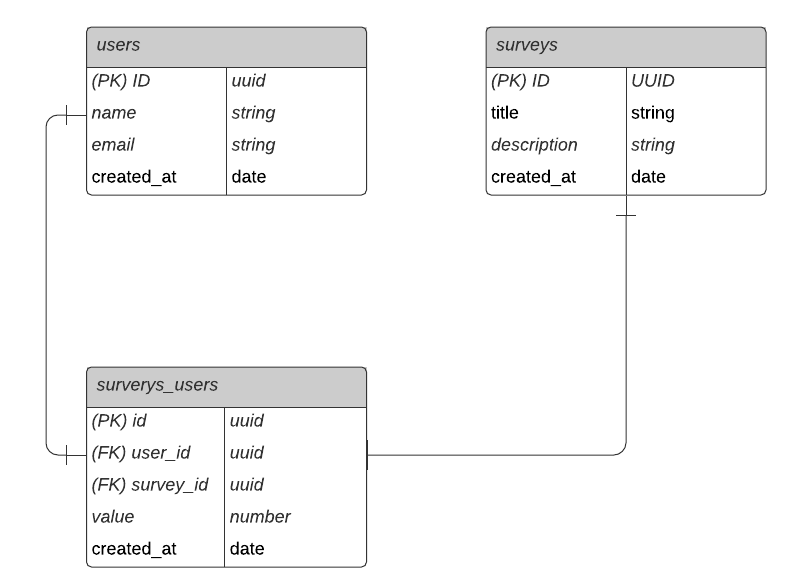

<h1 align="center">NPS</h1>

<p align="center">
  <a href="#-technologies">Technologies</a>&nbsp;&nbsp;&nbsp;|&nbsp;&nbsp;&nbsp;
  <a href="#-project">Project</a>&nbsp;&nbsp;&nbsp;|&nbsp;&nbsp;&nbsp;
  <a href="#-database-diagram">Database diagram</a>&nbsp;&nbsp;&nbsp;|&nbsp;&nbsp;&nbsp;
  <a href="#-how-to-build">How to build</a>&nbsp;&nbsp;&nbsp;|&nbsp;&nbsp;&nbsp;
  <a href="#-run-the-project">Run the project</a>&nbsp;&nbsp;&nbsp;|&nbsp;&nbsp;&nbsp;
  <a href="#-licence">Licence</a>
</p>

<p align="center">
  

  
</p>

<br>

## ✨ Technologies

This project was developed with the following technologies:

- [TypeScript](https://www.typescriptlang.org/)
- [Ethereal-Email](https://ethereal.email/)
- [TypeORM](https://typeorm.io/#/)
- [Express](https://expressjs.com/pt-br/)
- [Jest](https://jestjs.io/)
- [SQL Editor Beekeeper Studio](https://www.beekeeperstudio.io/)

## 💻 Project

It is an application that consists in calculate the NPS of a company. In it we make the registration of users, registration of surveys, sending e-mail for users to answer the satisfaction surveys and with that we can perform the calculation of the NPS.

This project was developed during the NodeJs trail, in the fourth edition of NLW. We learn concepts about what is an API, how to start a project using Typescript and Express for routes management, TypeORM for data manipulation, automated tests and e-mail sending.

## 🔶 Database diagram

<p align="center">

</p>

## 👷 How to build

```bash
# Clone the repository
$ git clone https://github.com/GustavoAriadno/NLW04-Nps

# Enter in the repository directory
$ cd NLW04-Nps

# Install dependencies
$ yarn install

# Run the migrations
$ yarn typeorm migration:run
```

## 🚀 Run the project

```bash
# Start the server
$ yarn dev
```
The application can be accessed at [`http://localhost:3333/`](http://localhost:3333).


## 📄 Licence

This project is under the MIT Licence. See the [LICENSE](LICENSE.md) file for more details.
